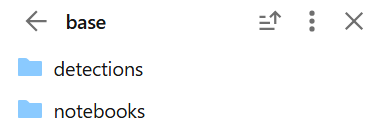
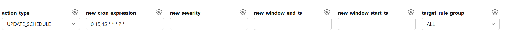
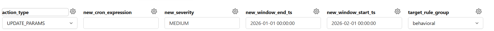
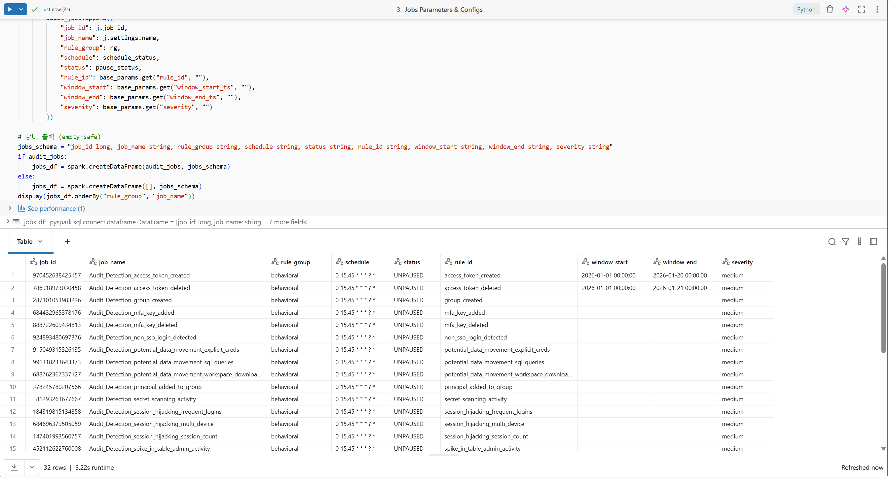

# Databricks Audit 기반 Cybersecurity Findings 파이프라인 운영 가이드

본 문서는 Databricks [`cybersec-workspace-detection-app`](https://github.com/databricks-solutions/cybersec-workspace-detection-app)의 **Detection Rule(탐지 룰)** 을 관리하고 스케줄링하기 위한 파이프라인 구조와 유지보수 방법에 대해 설명합니다.

**1 룰 = 1 개별 Databricks Job** 구조로 구성되어 있으며, `Serverless Compute`와 `job_configurator`를 활용한 동적 파라미터 관리에 최적화되어 있습니다.

DASIS 의 데모에서는 **system.access.audit, system.query.history** 테이블을 사용하지 않고, **sandbox.audit_poc.audit, sandbox.audit_poc.history** 테이블을 사용합니다. 이는 데모용으로 구성된 테이블이며, 실제 운영 시에는 올바른 테이블을 사용해야 합니다. 전체 코드베이스에 replace all 로 모든 테이블을 적절하게 변경해 주어야 합니다. 

---

## 0. 데이터브릭스 cybersec-workspace-detection-app 구성

### 0-1. 프로젝트 폴더 구조 및 주요 구성 요소
base 안에는 크게 두 개의 주요 폴더로 구성되어 있습니다:


*   **`detections/`**: 본 프로젝트에서 주로 관리하는 **Findings Rules**가 포함되어 있습니다.
    *   `detections/` 내의 원본 룰들은 추후 dasis의 `materialized_rules/`로 변환되어 실제 탐지에 사용됩니다.
    *   **Behavioral**: 30일 기준 데이터를 분석합니다.
    *   **Binary**: 24시간 기준 데이터를 분석합니다.
*   **`notebooks/`**: AI 감지, 유저 별 리포트, 데이터 반출입 보고서 등 유용한 노트북들이 포함되어 있습니다. 이 노트북들은 즉시 실행하여 필요한 정보를 얻는 용도로 활용할 수 있습니다.

기본적인 구성에 대한 자세한 내용은 `README.md`를 참고하시기 바랍니다.


---

## 1. 아키텍처 중심 구조

파이프라인은 탐지 룰을 중앙 레지스트리에 등록하고, 개별 Job을 동적으로 생성하여 독립적인 런타임 환경에서 각각 스케줄링 및 실행되도록 구성됩니다.

### 1-0. 소스 입력 데이터 및 시스템 테이블 (Source Data & System Tables)
탐지 룰은 Databricks에서 제공하는 시스템 테이블을 소스로 활용합니다. 분석 및 탐지 로직의 정확성을 위해 다음 테이블들에 대한 접근 권한이 사전에 확보되어야 합니다.

- **`system.access.audit`**: 워크스페이스 내의 모든 활동(로그인, 클러스터 생성, 노트북 실행 등)이 기록되는 핵심 감사 로그입니다.
- **`system.query.history`**: SQL 웨어하우스 및 클러스터에서 실행된 쿼리 이력을 추적하여 비정상적인 데이터 접근 패턴을 탐지합니다.
- (옵셔널) **`system.billing.usage`**: user_analysis 노트북에 사용되는 비용 소모를 모니터링하거나, 리소스 사용 패턴 분석을 위해 참조될 수 있습니다.

### 1-1. 메타데이터 및 상태 관리 테이블
- **`sandbox.audit_poc.rule_registry`**: 룰 그룹, 코드 실행 엔트리포인트를 관장하는 중앙 레지스트리.
- **`sandbox.audit_poc.rule_checkpoint`**: 증분 실행(Incremental Run)을 위한 상태 테이블. 최근 성공한 실행 윈도우 기록을 관리합니다.
- **`sandbox.audit_poc.rule_run_log`**: 각 룰 Job의 상세 실행 이력, 처리 건수, 성공/실패, 발생 에러 로그를 기록 및 적재하는 테이블.

```sql
CREATE TABLE IF NOT EXISTS sandbox.audit_poc.rule_registry (
  rule_id       STRING    NOT NULL, -- 예: potential_data_movement_sql_queries
  rule_group    STRING    NOT NULL, -- binary | behavioral | custom
  module_path   STRING    NOT NULL, -- 파이썬 모듈 경로(파일 위치)
  callable_name STRING    NOT NULL, -- 호출할 함수/클래스 이름
  severity      STRING,
  created_at    TIMESTAMP NOT NULL,
  updated_at    TIMESTAMP NOT NULL,
  enabled       BOOLEAN   NOT NULL
) USING DELTA
TBLPROPERTIES (delta.enableChangeDataFeed = true);

CREATE TABLE IF NOT EXISTS sandbox.audit_poc.rule_checkpoint (
  rule_id               STRING    NOT NULL,
  last_success_end_ts   TIMESTAMP,          -- 마지막으로 성공 처리한 끝 시각
  last_attempt_start_ts TIMESTAMP,
  last_attempt_end_ts   TIMESTAMP,
  last_status           STRING,             -- SUCCESS | FAILED
  last_error            STRING,
  updated_at            TIMESTAMP NOT NULL
) USING DELTA;

CREATE TABLE IF NOT EXISTS sandbox.audit_poc.rule_run_log (
  run_id          STRING    NOT NULL, -- uuid
  rule_id         STRING    NOT NULL,
  window_start_ts TIMESTAMP NOT NULL,
  window_end_ts   TIMESTAMP NOT NULL,
  started_at      TIMESTAMP NOT NULL,
  finished_at     TIMESTAMP,
  status          STRING    NOT NULL, -- SUCCESS | FAILED | SKIPPED
  row_count       BIGINT,
  duration_ms     BIGINT,
  runner_version  STRING,             -- git sha 등
  error_message   STRING,
  created_at      TIMESTAMP NOT NULL
) USING DELTA
PARTITIONED BY (rule_id);
```

### 1-2. 결과 (Findings) 적재 테이블
아래 테이블들은 `single_runner` 실행 시점에 각 룰의 스키마 정의에 따라 자동으로 생성(Auto-create) 및 관리됩니다.

- **`sandbox.audit_poc.findings_{rule_id}`**: 개별 룰별로 떨어지는 원본 수준의 결과들. (Append/MERGE 혼합 구조)
- **`sandbox.audit_poc.findings_unified`**: 통합 대시보드 및 알럿 연동을 위해 모든 룰의 결과를 공통 스키마로 표준화한 테이블. Payload는 `payload_json`에 담기며, 컬럼 해싱을 통한 `dedupe_key`로 동일 윈도우 내 중복 재처리에서 발생하는 데이터 중복을 완벽하게 방어합니다.

---

## 2. 주요 운영 노트북 및 파일 역할 (`dasis_notebooks/`)

### 2-1. `job_generator` (룰 셋업 및 등록 통합)
이 노트북은 파이프라인의 기초 셋업과 Job 발급을 담당하며 내부적으로 크게 3개의 스텝(셀)으로 나뉩니다.
1. **`00_materialize_rules_as_py`**: `base/detections/` 하위 코드를 Databricks 환경에서 안전하게 Import 할 수 있도록 순수 Python 파일(`.py`) 형태로 컴파일 및 `materialized_py/` 폴더에 변환(Materialize)합니다.
2. **`01_register_rules`**: Materialize된 룰들을 읽어 `rule_registry` DB에 등록 혹은 상태를 갱신하고, 최초 등록 규칙의 경우 `rule_checkpoint` 초기 상태 row를 구성합니다.
3. **`02_job_generator`**: 레지스트리에 등록된 활성화 룰(`enabled=true`)들을 기반으로, 각각 1개의 Databricks Job(예: `Audit_Detection_{rule_id}`)을 발급 및 생성합니다.
   - **`keep_history` (드롭다운 위젯 옵션)**: Job 생성 시 상단에서 값을 선택할 수 있습니다.
     - `true` (디폴트) : 기존 Job들을 지우지 않고 새 Job 이름 뒤에 날짜와 시간(예: `_20260226_123456`)을 붙여 이전 버전들을 보존합니다.
     - `false` : 새로 Job을 생성할 때 동일한 이름의 기존 Job들을 찾아 삭제함으로써 중복 없이 Job을 Replace합니다. (뒤에 날짜와 시간이 붙은 Job들 포함 삭제.)

### 2-2-1. `runners/single_runner.py` (실제 규칙 실행기)
앞서 생성된 개별 Databricks Job이 호출하는 **단일 실행기(Single Runner)** 입니다. 
Databricks 상에서 생성된 각 Job은 단일 Task(`single_runner`)를 바라보도록 구성되어 있습니다. 이 Task는 실행될 때 Job 레벨에서 설정된 인자(Parameters)를 넘겨받습니다. 

**Task가 전달받는 주요 파라미터 구성:**
- `RULE` (탐지 룰 ID)
- `WINDOW_START_TS` ({{job.start_time}} 형태의 동적 평가 시간 혹은 명시적 시간)
- `WINDOW_END_TS` ({{job.start_time}} 형태의 동적 평가 시간 혹은 명시적 시간)
- `SEVERITY` (현재 사용되고 있지는 않음)

`single_runner`는 위 파라미터(`rule_id`, `window_start_ts`, `window_end_ts`, `severity`)를 받아 레지스트리에서 해당 룰의 실제 모듈 경로와 함수명을 동적으로 찾아 로직을 실행합니다. 그 결과를 개별 `findings_{rule_id}` 테이블과 통합 뷰 격인 `findings_unified` 테이블에 나란히 MERGE 합니다. 최종 처리 성공/실패 내역은 `rule_run_log`와 `rule_checkpoint`에 꼼꼼하게 반영하여 추후 실행을 대비합니다.

### 2-2-2. `runners/bulk_runner.py` (모든 job 일회용 실행기)
이 노트북은 등록된 모든 활성 룰을 한꺼번에 순차적으로 실행하기 위한 도구입니다. 주로 파이프라인 초기 구축 시 과거 데이터를 일괄 탐지하거나, 로직 변경 후 특정 구간의 데이터를 재처리(Re-run)해야 할 때 사용합니다. 내부적으로 `rule_registry`에서 활성화된 룰 목록을 조회하여 루프를 돌며 각 룰을 실행하며, 실행 결과와 체크포인트는 `single_runner`와 동일한 메커니즘으로 `rule_run_log` 및 각 Findings 테이블에 기록됩니다. 또한 rule_group 별로 task parameter를 주어 실행할 수 있습니다.

### 2-3. `job_configurator` (job 설정기)
독립적으로 생성된 30여 개 이상의 잡(Job)들을 단일 UI 위젯에서 일괄 관리(Bulk Update) 할 수 있는 도우미 노트북입니다.




특정 `rule_group` 단위로 기간 파라미터를 변경하거나, CRON 스케줄을 일괄 지정하고, 필요시 특정 룰 그룹 전체를 한 번에 PAUSE / UNPAUSE 활성화 제어할 수 있습니다.
개별 job의 설정은 데이터브릭스 기본 Jobs & Pipelines UI에서 확인 및 수정 가능합니다.



> **힌트**: 3번째 셀을 돌리면 현재 모든 audit job들의 세팅 값 (schedule, status, parameter 값) 들을 확인할 수 있습니다.

---

## 3. 요건별 대처법 및 유지보수 가이드 (운영)

### 3-1. 신규 탐지 룰 추가 시 
새로운 위협이나 로그 패턴을 탐지하는 룰을 추가해야 할 경우 다음 순서를 따릅니다.

1. **규칙 파일 작성**: 레포지토리의 `base/detections/<rule_group>/` (예: `binary`, `behavioral` 폴더, 혹은 새 폴더) 경로에 새로운 파이썬 룰 파일을 생성하고 탐지 파이스파크 코드를 작성합니다.
2. **룰 등록 및 신규 Job 생성**
   - Databricks 작업 공간 내 `dasis_notebooks/job_generator/job_generator.py` 노트북을 실행하면 새로 등록된 룰에 대해 Databricks Job이 생성됩니다.
3. **스케줄 및 파라미터 구성**
   - `dasis_notebooks/job_configs/job_configurator.py` 노트북을 오픈합니다.
   - 대상 룰 그룹(혹은 전체)의 크론 스케줄(`UPDATE_SCHEDULE` 액션) 과 구동 파라미터를 사용자가 원하시는 주기에 맞추어 업데이트 해줍니다.
4. **Dashboard 관리 방법 (룰 추가 시)**
   - 새 룰이 추가되면 대시보드에서도 해당 룰 결과를 즉시 확인할 수 있도록 아래 순서로 반영합니다.
   - **Data 탭에 결과 테이블 추가**
     - 새 룰의 결과 테이블(예: `sandbox.audit_poc.findings_{rule_id}`)을 Dashboard의 **Data**에 추가합니다.
   - **차트 위젯 생성 후 테이블 형태로 표시**
     - 새 위젯을 만들고 방금 추가한 결과 테이블을 Dataset으로 연결합니다.
     - Visualization은 기본 차트 유형에서 시작하더라도 최종적으로 **Table**로 설정해 결과를 표 형태로 확인 가능하게 만듭니다.
   - **제목/설명 정리**
     -   위젯 제목은 룰명 기준으로 명확하게 작성하고, 설명에는 탐지 목적/해석 포인트를 간단히 기록합니다.


### 3-2. 기존 룰의 로직 변경 및 수정 시
탐지 조건이나 로직을 일부 변경해야 하여 `base/detections/...` 내에 위치한 소스 코드를 조정한 경우의 대처법입니다.
- 잡(Job)을 삭제하거나 새롭게 다시 Job Generator를 통해 덮어씌울 필요가 없습니다.
- 코드 수정 및 레포지토리 동기화(Pull) 후, `job_generator.py` 의 **`00_materialize_rules_as_py` 단계(첫 번째 셀)만 단 1회 실행**해 주면 됩니다. 
- 이후 예약된 스케줄러가 타겟 Job을 다시 실행할 때 최신 `.py` 모듈을 Import 하여 구동하게 되므로 로직 갱신이 곧바로 적용됩니다.

### 3-3. 특정 룰 일시정지 (비활성화) 방법
특정 기간 혹은 디버깅 이유로 룰을 정지하고 싶다면 두가지 방법이 모두 가능합니다.
- **추천 방식 (Job 스케줄러 단위 통제)**: `job_configurator.py` 에서 중단할 대상 그룹을 선택하고 `PAUSE_JOBS` 액션을 실행하여 스케줄러 단에서 편하게 비활성화 합니다. 일시중단했다가 나중에 언제든 `UNPAUSE_JOBS` 로 재개 하기가 매우 간편합니다.
- **원천 레지스트리 비활성화 (물리 삭제 대체 방식)**: 더 이상 런타임에 쓰이지 않아야 하는 아웃데이팅 룰이라면 `sandbox.audit_poc.rule_registry` 테이블 자체에서 SQL명령어로 `UPDATE ... SET enabled = false WHERE rule_id = '...'` 처리를 해둡니다. 

### 3-4. 과거 기간 재처리 (Backfill) 구동 방법
- `findings_unified` 에 적재 프로세스 진행시 `dedupe_key`(이벤트 Payload 전체 컬럼들의 Hash값)를 사용해 MERGE 하도록 구축했으므로, 동일 이벤트를 중복 적재할 위험이 원천 차단 되어있습니다.
- 이에 따라 데이터 유실이나 정책 변경에 의해 특정 과거 구간 구간을 다시 구동하고 싶다면:
  - 수정 및 점검하려는 개별 Job의 화면에서 'Run Now with Different Parameters' 옵션을 눌러 들어갑니다.
  - 파라미터 칸에 조회를 원하시는 `window_start_ts`와 `window_end_ts` 값을 수동으로 입력 후 재실행 버튼을 클릭합니다.
  - 과거 데이터를 리스캔하여 중복없이 병합 적재(MERGE) 해 주게 됩니다.


### 3-5. 원본 레포지토리(Upstream) 업데이트 반영 및 병합 가이드
본 프로젝트는 Databricks의 원본 `cybersec-workspace-detection-app`을 포크(Fork)하여 KRAFTON DASIS 환경에 맞춰 커스텀된 프로젝트입니다. 원본 레포지토리에 새로운 탐지 룰이 추가되거나 로직 개선 등의 업데이트가 발생했을 때, 이를 현재 프로젝트로 안전하게 가져오고 적용하는 방법은 다음과 같습니다.

1. **Upstream (원본 레포지토리) 리모트 추가 및 페치(Fetch)**
   - 로컬 작업 환경(Git)에서 원본 레포지토리를 `upstream`으로 등록하고 최신 변경 사항을 가져옵니다.
   ```bash
   git remote add upstream https://github.com/databricks-solutions/cybersec-workspace-detection-app.git
   git fetch upstream
   ```

2. **최신 변경 사항 병합 (Merge)**
   - 현재 작업 중인 브랜치(예: `main`)에 `upstream`의 변경 사항을 병합합니다.
   ```bash
   git merge upstream/main
   ```

3. **충돌(Conflict) 해결 및 커스텀 로직 유지**
   - 병합 과정에서 충돌이 발생할 수 있습니다. KRAFTON DASIS의 고유 로직(예: 커스텀 테이블 명칭, Payload Hashing 등)이 덮어씌워지지 않도록 주의하여 충돌을 해결해야 합니다.
   - 특히 데모용으로 수정한 테이블명(`sandbox.audit_poc.audit` 등)이 원본의 `system.access.audit` 등으로 되돌아갔을 수 있으므로 다시 한번 확인하여 올바른 테이블명으로 변경해 줍니다.

4. **업데이트 적용 (Databricks 파이프라인 동기화)**
   - 병합된 최신 코드를 Databricks Repos에서 Pull 받아 갱신합니다.
   - 원본 룰 코드(`base/detections/...`)의 변경 사항을 반영하기 위해 **`job_generator.py` 노트북의 `00_materialize_rules_as_py` 스텝을 실행**하여 최신 룰 파이썬 파일들을 다시 Materialize합니다.
   - 만약 원본 업데이트를 통해 **새로운 룰이 추가된 경우**라면, 이어서 **`01_register_rules`** 와 **`02_job_generator`** 스텝을 전체 실행하여 레지스트리에 룰을 등록하고 새로운 Job을 생성합니다.
